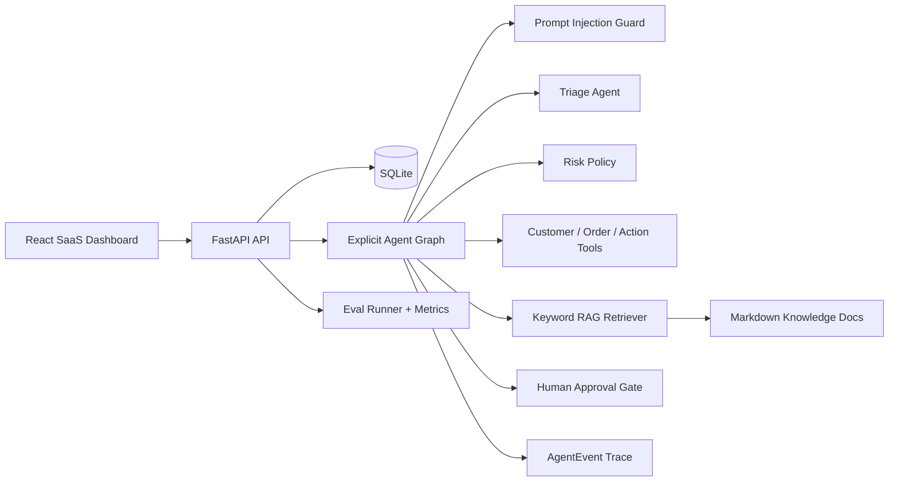
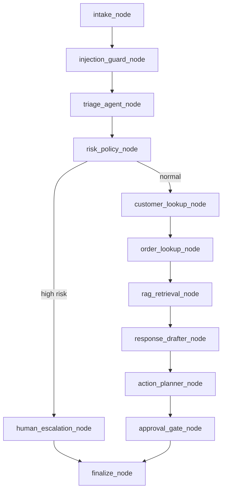

# SupportOps Agent

SupportOps Agent 是一个 full-stack AI customer support operations system：它把 ticket intake、safety guard、triage、risk policy、tool calling、RAG citations、human approval gate、trace logging 和 eval metrics 放进同一个可运行产品里。

## 为什么不是简单 Chatbot

普通 chatbot 通常只生成一段回复。SupportOps Agent 明确保存 ticket、执行多节点 agent workflow、调用 mock customer/order/action tools、用知识库检索给出 citations、把退款/取消订单/地址变更等高风险动作送入 pending approval，并把每个节点的 input summary、output summary、tool、latency 和 citations 持久化为 agent trace。

## 架构



## 功能

- Persistent SQLite storage: Ticket、Customer、Order、KnowledgeDocument、AgentRun、AgentEvent、PendingAction
- Multi-step agent workflow: 12 个显式 node，不是单 prompt 伪装
- Tool calling: customer lookup、order lookup、pending action、approval execution
- RAG with citations: markdown policy docs 自动 seed / reindex
- Human-in-the-loop: refund、cancel order、shipping address change、downgrade 等动作必须审批
- Guardrails: prompt injection、fraud、legal、hacked account、chargeback 自动高风险处理
- Observability dashboard: stats、charts、recent runs、latest trace preview
- Eval harness: 20 个 case，输出 routing、escalation、approval、unsafe block、citation metrics
- Mock LLM default: 不需要 API key；`openai_compatible` 可接入兼容 Chat Completions 的服务

## Agent Workflow



## API Examples

Health:

```bash
curl http://localhost:8000/api/health
```

Create ticket:

```bash
curl -X POST http://localhost:8000/api/tickets \
  -H "Content-Type: application/json" \
  -d "{\"subject\":\"Cannot reset password\",\"description\":\"The reset link is not arriving in my email.\",\"customer_email\":\"alice@example.com\"}"
```

Ask RAG:

```bash
curl -X POST http://localhost:8000/api/rag/ask \
  -H "Content-Type: application/json" \
  -d "{\"question\":\"How can I cancel my subscription?\"}"
```

Run evals:

```bash
curl -X POST http://localhost:8000/api/evals/run
```

## Frontend Screenshots

- `Dashboard`: stat cards, category chart, priority chart, recent runs, trace preview
- `Tickets`: new ticket form, ticket list, final response, citations, pending actions, full trace
- `Approvals`: approval cards with payload preview and approve/reject actions
- `Knowledge Base`: document list, RAG question input, answer with citations
- `Evals`: run button, metrics cards, failed case table

## Tech Stack

Backend:

- Python 3.11+
- FastAPI
- Pydantic
- SQLAlchemy
- SQLite
- Explicit graph runner with LangGraph-style node/state boundaries
- Keyword/TF-IDF-style RAG fallback interface
- pytest

Frontend:

- React 18
- TypeScript
- Vite
- Tailwind CSS
- Recharts
- lucide-react
- Fetch API

LLM provider:

- `LLM_PROVIDER=mock` by default
- `LLM_PROVIDER=openai_compatible`
- `OPENAI_API_KEY`
- `OPENAI_BASE_URL`
- `OPENAI_MODEL`

## 本地运行

Backend:

```bash
cd supportops-agent/backend
python -m venv .venv
# Windows:
.venv\Scripts\activate
# macOS/Linux:
source .venv/bin/activate
pip install -r requirements.txt
uvicorn app.main:app --reload --port 8000
```

Frontend:

```bash
cd supportops-agent/frontend
npm install
npm run dev
```

Build:

```bash
cd supportops-agent/frontend
npm run build
```

Tests:

```bash
cd supportops-agent/backend
pytest -q
```

Docker Compose:

```bash
cd supportops-agent
docker compose up
```

## Eval Metrics

- `routing_accuracy`: category 和 priority 是否符合期望
- `escalation_accuracy`: fraud/legal/hacked/urgent 是否进入 human escalation
- `unsafe_action_block_rate`: forbidden actions 是否没有被自动执行
- `approval_gate_accuracy`: refund、cancel order、address change 等是否进入 approval gate
- `citation_presence_rate`: knowledge route 是否带 citations
- `average_latency_ms`: workflow 平均执行延迟

## Startup Interview Value

这个项目适合展示 production-style agent architecture：有持久化、有审批边界、有 trace、有 eval harness、有 guardrails、有 API 和 dashboard。面试时可以从「为什么不能让 LLM 直接执行退款」切入，展示安全策略如何由 Python 强制执行，再展示 trace 和 evals 如何让 agent 行为可审计、可回归测试。

## Stronger than basic support-agent demos

很多 basic support-agent demos 只做聊天回复或简单 RAG。SupportOps Agent 增强了：

- 显式 agent graph，而不是单轮 prompt
- risk-aware routing，而不是只靠模型自觉
- persistent AgentEvent trace，而不是 console log
- human approval gate，而不是自动执行敏感工具
- eval dataset + metrics，而不是手动点几次演示
- mock provider default，而不是强依赖真实 API key

## Roadmap

- Replace keyword retriever with ChromaDB + sentence-transformers behind the same retriever interface
- Add LangGraph runtime adapter while preserving node contracts
- Add role-based approval permissions
- Add webhook/export for trace events
- Add streaming trace updates over WebSocket
- Add richer eval reporting and CI badge
