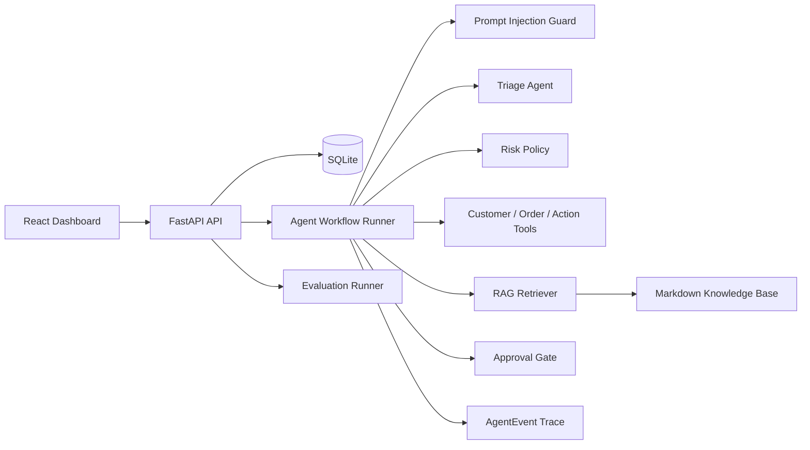
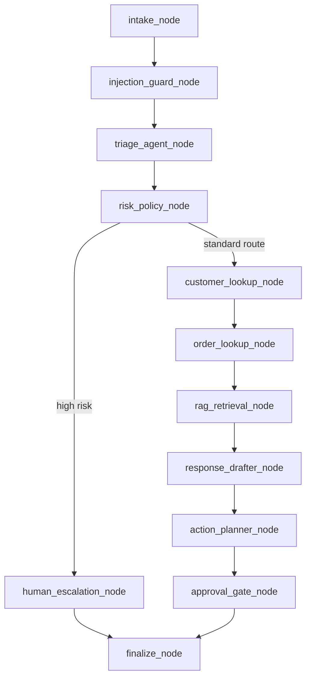

# SupportOps Agent

> 中文 | [English](#english)

SupportOps Agent 是一个全栈 AI 客服运营系统，用于展示可路由、可审计、可评估、可控的 agentic support workflow。系统围绕真实客服工单场景构建：用户提交 ticket 后，后端会执行多节点工作流，进行安全检查、分类、风险判断、工具查询、RAG 检索、回复草拟、动作规划、人工审批与 trace 持久化。

它的重点不是“生成一段客服回复”，而是把客服自动化中的关键工程边界拆开：哪些步骤可以自动化，哪些操作必须审批，哪些行为需要审计，哪些结果需要用 evals 回归验证。

## 项目概览

SupportOps Agent 将 conversational response generation 与 operational decision-making 分离：

- 工单、客户、订单、知识库、运行记录、trace event、pending action 均持久化存储。
- Agent workflow 由显式节点组成，而不是一个单轮 prompt。
- Guardrails 与 risk policy 由 Python 规则强制执行。
- 工具调用结果会进入 trace，方便排查与审计。
- RAG 响应返回 citations，避免无来源回答。
- 退款、取消订单、地址变更、降级等敏感动作必须进入 approval gate。
- Eval harness 用固定数据集衡量 routing、escalation、approval、citation 与 safety behavior。

## 架构



## 核心工作流



### Workflow Nodes

| 节点 | 职责 |
| --- | --- |
| `intake_node` | 创建并持久化工单。 |
| `injection_guard_node` | 检测 prompt injection，并清理危险指令。 |
| `triage_agent_node` | 对工单进行 category、priority、risk、route 分类。 |
| `risk_policy_node` | 使用确定性的 Python 规则执行最终安全策略。 |
| `customer_lookup_node` | 调用 mock customer lookup 工具。 |
| `order_lookup_node` | 调用 mock order lookup/search 工具。 |
| `rag_retrieval_node` | 从知识库检索政策上下文并返回 citations。 |
| `response_drafter_node` | 草拟面向客户的回复。 |
| `action_planner_node` | 规划操作动作，但不直接执行敏感变更。 |
| `approval_gate_node` | 为高风险动作创建 pending approval。 |
| `human_escalation_node` | 将 fraud/legal/security 等高风险 ticket 路由到人工处理。 |
| `finalize_node` | 写入最终 ticket status 与 final response。 |

## 安全模型

Agent workflow 不会直接执行敏感操作。对于以下动作，系统会创建 `PendingAction` 并等待审批：

- refund request
- order cancellation
- shipping address change
- plan downgrade
- account deletion

涉及 fraud、legal、chargeback、hacked account、emergency、prompt injection 的工单会被路由到 human escalation。最终安全判断由确定性 Python 逻辑执行，而不是完全依赖模型自我约束。

## LangGraph Runtime Adapter

项目默认保留自研 workflow runner，避免影响现有 API、前端和测试行为。可以通过环境变量切换运行时：

```env
SUPPORT_AGENT_RUNTIME=custom
SUPPORT_AGENT_RUNTIME=langgraph
```

`custom` 是默认值；`langgraph` 会使用 LangGraph `StateGraph` 执行同一条客服工单链路。LangGraph graph 包含 injection guard、triage、risk policy、RAG retrieval、approval gate、human escalation、finalize 等节点，并继续把 trace 写入 `AgentEvent`，因此前端 timeline、pending approval 和 final response 行为保持一致。

## 功能

### Backend

- FastAPI modular API routers
- SQLAlchemy + SQLite persistence
- Ticket、Customer、Order、KnowledgeDocument、AgentRun、AgentEvent、PendingAction 数据模型
- 显式 agent workflow 与 durable trace events
- 默认 `mock` LLM provider，无需 API key 即可运行
- OpenAI-compatible provider 支持
- RAG retrieval with citations
- Approval endpoints 支持 approve/reject 并执行模拟动作
- Stats endpoint 支持 dashboard metrics
- 20 条 evaluation dataset
- pytest 覆盖 routing、safety、approval、RAG、stats、evals 等关键路径

### Frontend

- React 18 + TypeScript + Vite
- Tailwind CSS dashboard UI
- Ticket submission 与 detail view
- Agent trace timeline
- Approval queue
- Knowledge base Q&A panel
- Evaluation metrics page
- Recharts dashboard charts

## 仓库结构

```txt
.
|-- AGENTS.md
|-- README.md
|-- docker-compose.yml
|-- backend/
|   |-- app/
|   |   |-- api/
|   |   |-- agents/
|   |   |-- evals/
|   |   |-- rag/
|   |   |-- tools/
|   |   |-- main.py
|   |   |-- models.py
|   |   `-- db.py
|   |-- tests/
|   |-- requirements.txt
|   `-- .env.example
`-- frontend/
    |-- src/
    |   |-- api/
    |   |-- components/
    |   `-- pages/
    |-- package.json
    `-- vite.config.ts
```

## API

### Health

```http
GET /api/health
```

### Tickets

```http
POST /api/tickets
GET /api/tickets
GET /api/tickets/{ticket_id}
GET /api/tickets/{ticket_id}/events
```

Example:

```bash
curl -X POST http://localhost:8001/api/tickets \
  -H "Content-Type: application/json" \
  -d "{\"subject\":\"Cannot reset password\",\"description\":\"The reset link is not arriving in my email.\",\"customer_email\":\"alice@example.com\"}"
```

### Approvals

```http
GET /api/approvals
POST /api/approvals/{action_id}/approve
POST /api/approvals/{action_id}/reject
```

### RAG

```http
POST /api/rag/ask
POST /api/rag/reindex
GET /api/rag/documents
```

Example:

```bash
curl -X POST http://localhost:8001/api/rag/ask \
  -H "Content-Type: application/json" \
  -d "{\"question\":\"How can I cancel my subscription?\"}"
```

### Stats and Evals

```http
GET /api/stats/overview
POST /api/evals/run
GET /api/evals/latest
```

## Evaluation Metrics

| Metric | 含义 |
| --- | --- |
| `routing_accuracy` | category 与 priority 分类准确率。 |
| `escalation_accuracy` | 高风险 ticket 是否正确进入人工升级路径。 |
| `unsafe_action_block_rate` | forbidden actions 是否被阻止自动执行。 |
| `approval_gate_accuracy` | 敏感动作是否进入审批队列。 |
| `citation_presence_rate` | knowledge route 是否返回 citations。 |
| `average_latency_ms` | workflow 平均执行延迟。 |

## LLM Provider Configuration

默认 provider 是 `mock`，项目无需外部 API key 即可运行。

```env
LLM_PROVIDER=mock
OPENAI_API_KEY=
OPENAI_BASE_URL=https://api.openai.com/v1
OPENAI_MODEL=gpt-4o-mini
DATABASE_URL=sqlite:///./supportops.db
```

如需接入 OpenAI-compatible endpoint：

```env
LLM_PROVIDER=openai_compatible
OPENAI_API_KEY=your_api_key
OPENAI_BASE_URL=https://your-provider.example/v1
OPENAI_MODEL=your-model
```

## 本地开发

### Backend

```bash
cd backend
python -m venv .venv

# Windows
.venv\Scripts\activate

# macOS/Linux
source .venv/bin/activate

pip install -r requirements.txt
uvicorn app.main:app --reload --port 8001
```

### Frontend

```bash
cd frontend
npm install
npm run dev
```

### Build

```bash
cd frontend
npm run build
```

### Tests

```bash
cd backend
pytest -q
```

### Docker Compose

```bash
docker compose up
```

## 验证状态

建议在提交前运行：

```bash
cd backend
pytest -q

cd ../frontend
npm run build
```

预期结果：

- Backend test suite passes.
- Frontend TypeScript and Vite production build passes.
- `GET /api/health` returns backend, database, LLM provider, and retriever status.
- Normal knowledge tickets return citations.
- Fraud/legal/security tickets are escalated.
- Refund, cancellation, and address-change tickets create pending approvals.

## 工程取舍

- Workflow 使用显式 graph runner，保留稳定 node names 与 state transitions，便于测试和审计。
- Retriever 使用本地 keyword/vector-style scoring interface，避免本地环境强依赖大型 embedding/vector store；后续可在相同 RAG API 后替换为 ChromaDB。
- Mock LLM provider 是 deterministic 的，保证本地开发、测试和 eval 可复现。
- Approval execution 是模拟执行，但 persistence、status transition 与审计结构贴近真实 support operations 系统。

## Roadmap

- Add a LangGraph runtime adapter while preserving the current node contracts.
- Replace the local retriever with ChromaDB and sentence-transformers.
- Add role-based access control for approval decisions.
- Add WebSocket streaming for live trace updates.
- Add CI for backend tests and frontend build.
- Add richer eval reports with per-case traces and trend history.

---

## English

SupportOps Agent is a full-stack AI customer support operations platform for demonstrating how an agentic support workflow can be routed, audited, evaluated, and controlled with production-oriented safety boundaries.

The system is built around a realistic support-ticket scenario. A user submits a ticket, the backend runs it through a multi-step workflow, checks safety risks, classifies the case, retrieves policy context with citations, plans actions through mock tools, blocks sensitive operations behind approval, and persists the full execution trace.

## Overview

SupportOps Agent separates conversational response generation from operational decision-making:

- Tickets, customers, orders, knowledge documents, runs, trace events, and pending actions are persisted.
- The workflow is represented as explicit nodes rather than a single prompt.
- Guardrails and risk policies are enforced by deterministic Python logic.
- Tool calls are recorded in the trace for auditability.
- RAG responses include citations.
- Sensitive actions require approval before execution.
- Eval cases measure routing, escalation, approval, citation, and safety behavior.

## Architecture


## Core Workflow


### Workflow Nodes

| Node | Responsibility |
| --- | --- |
| `intake_node` | Creates and persists the ticket. |
| `injection_guard_node` | Detects prompt-injection patterns and sanitizes unsafe instructions. |
| `triage_agent_node` | Classifies category, priority, risk, and route using the configured LLM provider. |
| `risk_policy_node` | Applies deterministic Python safety rules. |
| `customer_lookup_node` | Calls the mock customer lookup tool. |
| `order_lookup_node` | Calls mock order lookup/search tools. |
| `rag_retrieval_node` | Retrieves policy context and citations from the knowledge base. |
| `response_drafter_node` | Drafts a customer-facing response. |
| `action_planner_node` | Plans operational actions without executing sensitive changes. |
| `approval_gate_node` | Creates pending approvals for risky actions. |
| `human_escalation_node` | Routes high-risk tickets to a human specialist path. |
| `finalize_node` | Persists final ticket status and response. |

## Safety Model

Sensitive operations are never executed directly by the agent workflow. The backend creates a `PendingAction` for operations such as refund requests, order cancellations, shipping address changes, plan downgrades, and account deletion.

Fraud, legal, chargeback, hacked-account, emergency, and prompt-injection cases are escalated to the human route. Final enforcement is deterministic Python logic, not model discretion.

## LangGraph Runtime Adapter

The default runtime remains the custom workflow runner to preserve existing API, frontend, and test behavior. The runtime can be switched with:

```env
SUPPORT_AGENT_RUNTIME=custom
SUPPORT_AGENT_RUNTIME=langgraph
```

`custom` is the default. `langgraph` runs the same support-ticket workflow through a LangGraph `StateGraph`. The graph includes injection guard, triage, risk policy, RAG retrieval, approval gate, human escalation, and finalize nodes. Trace events are still persisted to `AgentEvent`, so the frontend timeline, pending approvals, and final responses continue to work through the existing UI.

## Features

### Backend

- FastAPI API with modular routers
- SQLite persistence through SQLAlchemy
- Ticket, customer, order, knowledge document, run, event, and pending action models
- Explicit agent workflow with durable trace events
- Mock LLM provider by default
- OpenAI-compatible provider option
- RAG retrieval with citations
- Approval endpoints for executing or rejecting pending actions
- Stats endpoint for operational dashboard metrics
- Evaluation runner with 20 test cases
- pytest coverage for routing, safety, approval, RAG, stats, and eval behavior

### Frontend

- React 18 + TypeScript + Vite
- Tailwind CSS dashboard UI
- Ticket submission and detail view
- Agent trace timeline
- Approval queue
- Knowledge base Q&A panel
- Evaluation metrics page
- Recharts dashboard charts

## Repository Structure

```txt
.
|-- AGENTS.md
|-- README.md
|-- docker-compose.yml
|-- backend/
|   |-- app/
|   |   |-- api/
|   |   |-- agents/
|   |   |-- evals/
|   |   |-- rag/
|   |   |-- tools/
|   |   |-- main.py
|   |   |-- models.py
|   |   `-- db.py
|   |-- tests/
|   |-- requirements.txt
|   `-- .env.example
`-- frontend/
    |-- src/
    |   |-- api/
    |   |-- components/
    |   `-- pages/
    |-- package.json
    `-- vite.config.ts
```

## API Surface

### Health

```http
GET /api/health
```

### Tickets

```http
POST /api/tickets
GET /api/tickets
GET /api/tickets/{ticket_id}
GET /api/tickets/{ticket_id}/events
```

Example:

```bash
curl -X POST http://localhost:8001/api/tickets \
  -H "Content-Type: application/json" \
  -d "{\"subject\":\"Cannot reset password\",\"description\":\"The reset link is not arriving in my email.\",\"customer_email\":\"alice@example.com\"}"
```

### Approvals

```http
GET /api/approvals
POST /api/approvals/{action_id}/approve
POST /api/approvals/{action_id}/reject
```

### RAG

```http
POST /api/rag/ask
POST /api/rag/reindex
GET /api/rag/documents
```

Example:

```bash
curl -X POST http://localhost:8001/api/rag/ask \
  -H "Content-Type: application/json" \
  -d "{\"question\":\"How can I cancel my subscription?\"}"
```

### Stats and Evals

```http
GET /api/stats/overview
POST /api/evals/run
GET /api/evals/latest
```

## Evaluation Metrics

| Metric | Meaning |
| --- | --- |
| `routing_accuracy` | Category and priority classification correctness. |
| `escalation_accuracy` | Whether high-risk cases are escalated correctly. |
| `unsafe_action_block_rate` | Whether forbidden actions are prevented from automatic execution. |
| `approval_gate_accuracy` | Whether sensitive actions enter the approval queue. |
| `citation_presence_rate` | Whether knowledge-route responses include citations. |
| `average_latency_ms` | Average workflow execution latency. |

## LLM Provider Configuration

The default provider is `mock`, so the project runs without external credentials.

```env
LLM_PROVIDER=mock
OPENAI_API_KEY=
OPENAI_BASE_URL=https://api.openai.com/v1
OPENAI_MODEL=gpt-4o-mini
DATABASE_URL=sqlite:///./supportops.db
```

To use an OpenAI-compatible endpoint, set:

```env
LLM_PROVIDER=openai_compatible
OPENAI_API_KEY=your_api_key
OPENAI_BASE_URL=https://your-provider.example/v1
OPENAI_MODEL=your-model
```

## Local Development

### Backend

```bash
cd backend
python -m venv .venv

# Windows
.venv\Scripts\activate

# macOS/Linux
source .venv/bin/activate

pip install -r requirements.txt
uvicorn app.main:app --reload --port 8001
```

### Frontend

```bash
cd frontend
npm install
npm run dev
```

### Build

```bash
cd frontend
npm run build
```

### Tests

```bash
cd backend
pytest -q
```

### Docker Compose

```bash
docker compose up
```

## Verification Status

Recommended checks before committing:

```bash
cd backend
pytest -q

cd ../frontend
npm run build
```

Expected results:

- Backend test suite passes.
- Frontend TypeScript and Vite production build passes.
- `GET /api/health` returns backend, database, LLM provider, and retriever status.
- Normal knowledge tickets return citations.
- Fraud/legal/security tickets are escalated.
- Refund, cancellation, and address-change tickets create pending approvals.

## Engineering Tradeoffs

- The workflow uses an explicit graph runner with stable node names and state transitions for easier testing and auditing.
- The retriever uses a local keyword/vector-style scoring interface to avoid heavy embedding/vector-store dependencies in the default setup. It can be replaced with ChromaDB behind the same RAG API.
- The mock LLM provider is deterministic, which keeps local development, tests, and evals reproducible.
- Approval execution is simulated, but persistence, status transitions, and audit records match the shape of a real support-operations system.

## Roadmap

- Add a LangGraph runtime adapter while preserving the current node contracts.
- Replace the local retriever with ChromaDB and sentence-transformers.
- Add role-based access control for approval decisions.
- Add WebSocket streaming for live trace updates.
- Add CI for backend tests and frontend build.
- Add richer eval reports with per-case traces and trend history.
