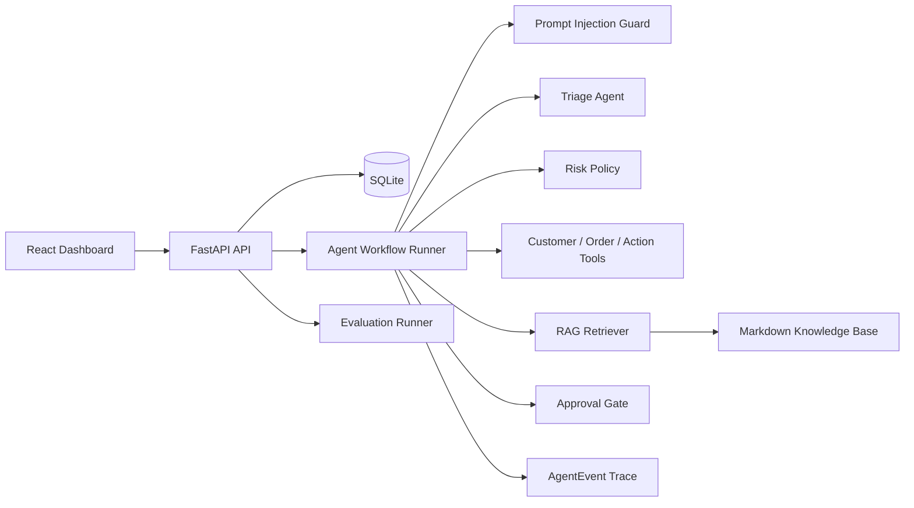
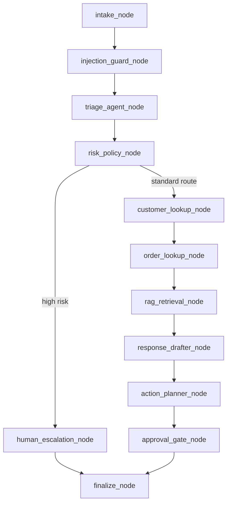

# SupportOps Agent

SupportOps Agent is a full-stack AI customer support operations platform that demonstrates how an agentic support workflow can be routed, audited, evaluated, and controlled with production-oriented safety boundaries.

The project is designed around a practical customer support scenario: a user submits a support ticket, the backend runs it through a deterministic multi-step agent workflow, retrieves policy context with citations, plans actions through mock tools, blocks risky operations behind human approval, and persists the full execution trace for observability and evaluation.

## Overview

SupportOps Agent is not a single-turn chatbot. It separates conversational response generation from operational decision-making:

- Ticket data is persisted in SQLite.
- Workflow steps are represented as explicit nodes.
- Guardrails and risk policies are enforced in Python.
- Tool calls are recorded and scoped.
- RAG responses include citations.
- Sensitive actions require approval before execution.
- Agent traces are stored as structured events.
- Evaluation cases measure routing, escalation, approval, citation, and safety behavior.

This makes the system easier to inspect, test, and extend than a prompt-only support assistant.

## Architecture



## Core Workflow



### Workflow Nodes

| Node | Responsibility |
| --- | --- |
| `intake_node` | Creates and persists the ticket. |
| `injection_guard_node` | Detects prompt-injection patterns and sanitizes unsafe instructions. |
| `triage_agent_node` | Classifies category, priority, risk, and route using the configured LLM provider. |
| `risk_policy_node` | Applies deterministic Python safety rules. |
| `customer_lookup_node` | Calls the mock customer lookup tool. |
| `order_lookup_node` | Calls mock order lookup/search tools. |
| `rag_retrieval_node` | Retrieves policy context and citations from the knowledge base. |
| `response_drafter_node` | Drafts a customer-facing response. |
| `action_planner_node` | Plans operational actions without executing sensitive changes. |
| `approval_gate_node` | Creates pending approvals for risky actions. |
| `human_escalation_node` | Routes high-risk tickets to a human specialist path. |
| `finalize_node` | Persists final ticket status and response. |

## Safety Model

Sensitive operations are never executed directly by the agent workflow. The backend creates a `PendingAction` for operations such as:

- refund request
- order cancellation
- shipping address change
- plan downgrade
- account deletion

Fraud, legal, chargeback, hacked-account, emergency, and prompt-injection cases are escalated to the human route. The final enforcement is deterministic Python logic, not model discretion.

## Features

### Backend

- FastAPI API with modular routers
- SQLite persistence through SQLAlchemy
- Ticket, customer, order, knowledge document, run, event, and pending action models
- Explicit agent workflow with durable trace events
- Mock LLM provider by default
- OpenAI-compatible provider option
- RAG retrieval with citations
- Approval endpoints for executing or rejecting pending actions
- Stats endpoint for operational dashboard metrics
- Evaluation runner with 20 test cases
- pytest coverage for core routing, safety, approval, RAG, stats, and eval behavior

### Frontend

- React 18 + TypeScript + Vite
- Tailwind CSS SaaS-style dashboard
- Ticket submission and detail view
- Agent trace timeline
- Approval queue
- Knowledge base Q&A panel
- Evaluation metrics page
- Recharts-based dashboard charts

## Repository Structure

```txt
.
├── AGENTS.md
├── README.md
├── docker-compose.yml
├── backend/
│   ├── app/
│   │   ├── api/
│   │   ├── agents/
│   │   ├── evals/
│   │   ├── rag/
│   │   ├── tools/
│   │   ├── main.py
│   │   ├── models.py
│   │   └── db.py
│   ├── tests/
│   ├── requirements.txt
│   └── .env.example
└── frontend/
    ├── src/
    │   ├── api/
    │   ├── components/
    │   └── pages/
    ├── package.json
    └── vite.config.ts
```

## API Surface

### Health

```http
GET /api/health
```

### Tickets

```http
POST /api/tickets
GET /api/tickets
GET /api/tickets/{ticket_id}
GET /api/tickets/{ticket_id}/events
```

Example:

```bash
curl -X POST http://localhost:8000/api/tickets \
  -H "Content-Type: application/json" \
  -d "{\"subject\":\"Cannot reset password\",\"description\":\"The reset link is not arriving in my email.\",\"customer_email\":\"alice@example.com\"}"
```

### Approvals

```http
GET /api/approvals
POST /api/approvals/{action_id}/approve
POST /api/approvals/{action_id}/reject
```

### RAG

```http
POST /api/rag/ask
POST /api/rag/reindex
GET /api/rag/documents
```

Example:

```bash
curl -X POST http://localhost:8000/api/rag/ask \
  -H "Content-Type: application/json" \
  -d "{\"question\":\"How can I cancel my subscription?\"}"
```

### Stats and Evaluations

```http
GET /api/stats/overview
POST /api/evals/run
GET /api/evals/latest
```

## Evaluation Metrics

The evaluation runner processes a static dataset of support tickets and reports:

| Metric | Meaning |
| --- | --- |
| `routing_accuracy` | Category and priority classification correctness. |
| `escalation_accuracy` | Whether high-risk cases are escalated correctly. |
| `unsafe_action_block_rate` | Whether forbidden actions are prevented from automatic execution. |
| `approval_gate_accuracy` | Whether sensitive actions enter the approval queue. |
| `citation_presence_rate` | Whether knowledge-route responses include citations. |
| `average_latency_ms` | Average workflow execution latency. |

## LLM Provider Configuration

The default provider is `mock`, so the project runs without external credentials.

```env
LLM_PROVIDER=mock
OPENAI_API_KEY=
OPENAI_BASE_URL=https://api.openai.com/v1
OPENAI_MODEL=gpt-4o-mini
DATABASE_URL=sqlite:///./supportops.db
```

To use an OpenAI-compatible endpoint, set:

```env
LLM_PROVIDER=openai_compatible
OPENAI_API_KEY=your_api_key
OPENAI_BASE_URL=https://your-provider.example/v1
OPENAI_MODEL=your-model
```

## Local Development

### Backend

```bash
cd backend
python -m venv .venv

# Windows
.venv\Scripts\activate

# macOS/Linux
source .venv/bin/activate

pip install -r requirements.txt
uvicorn app.main:app --reload --port 8000
```

### Frontend

```bash
cd frontend
npm install
npm run dev
```

### Build

```bash
cd frontend
npm run build
```

### Tests

```bash
cd backend
pytest -q
```

### Docker Compose

```bash
docker compose up
```

## Verification Status

Current verification commands:

```bash
cd backend
pytest -q

cd ../frontend
npm run build
```

Expected results:

- Backend test suite passes.
- Frontend TypeScript and Vite production build passes.
- `GET /api/health` returns backend, database, LLM provider, and retriever status.
- Normal knowledge tickets return citations.
- Fraud/legal/security tickets are escalated.
- Refund, cancellation, and address-change tickets create pending approvals.

## Engineering Tradeoffs

- The workflow uses an explicit graph runner with stable node names and state transitions. This keeps the implementation lightweight while preserving LangGraph-style orchestration boundaries.
- The retriever uses a local keyword/vector-style scoring interface instead of heavyweight embedding dependencies. It can be replaced by ChromaDB or another vector store behind the same RAG API.
- The mock LLM provider is deterministic to make local development, tests, and evaluation reproducible.
- Approval execution is simulated, but the persistence and status transitions mirror the shape of a real support-operations system.

## Roadmap

- Add a LangGraph runtime adapter while preserving the current node contracts.
- Replace the local retriever with ChromaDB and sentence-transformers.
- Add role-based access control for approval decisions.
- Add WebSocket streaming for live trace updates.
- Add CI for backend tests and frontend build.
- Add richer eval reports with per-case traces and trend history.
